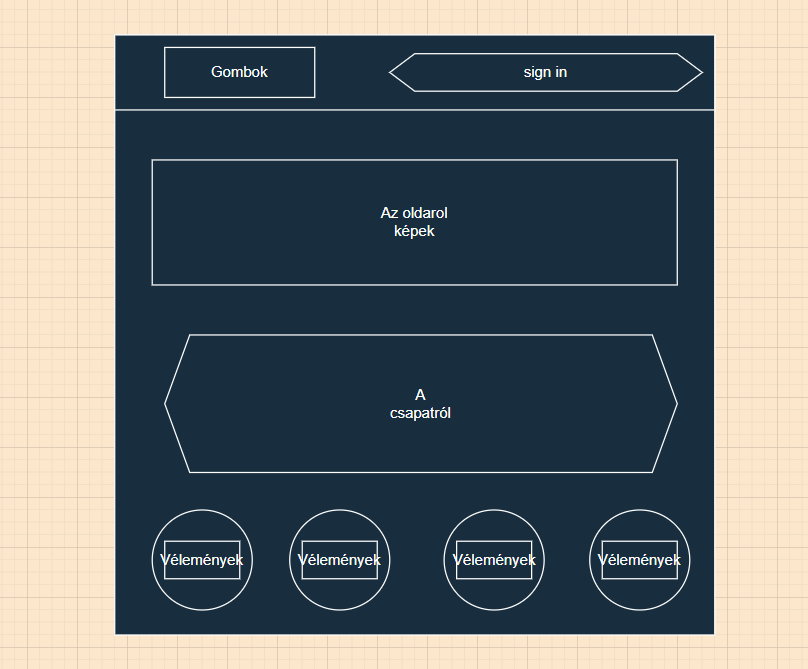
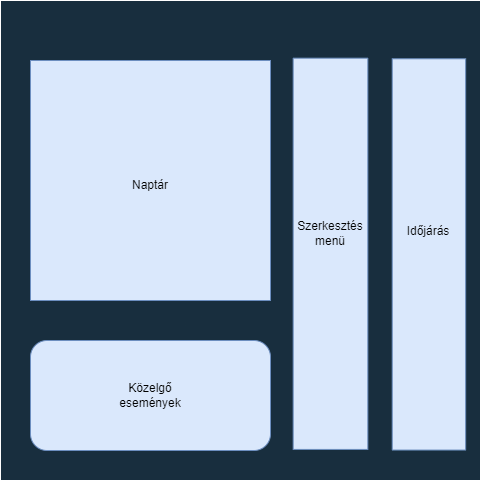
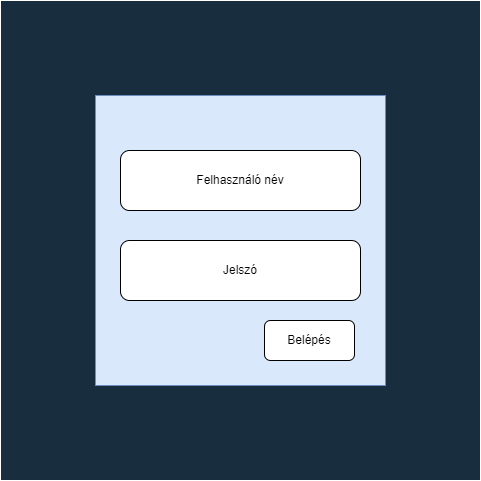
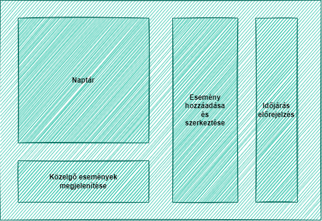
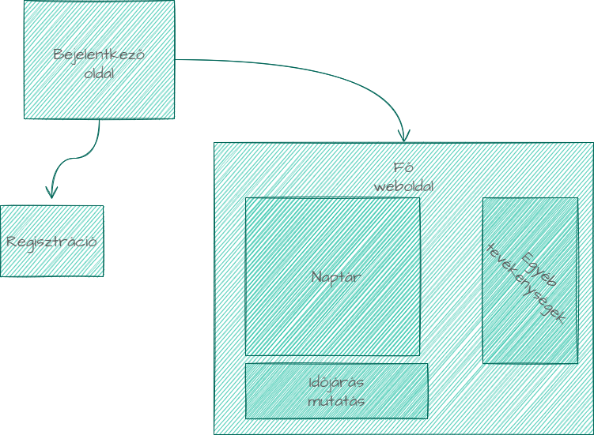
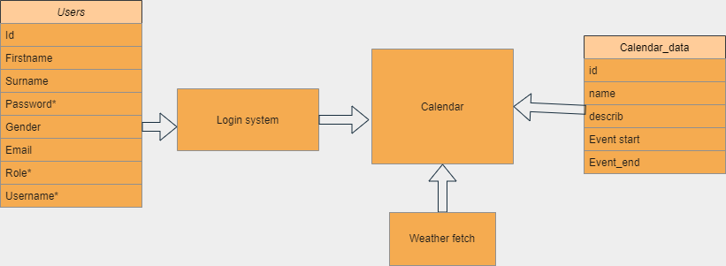

# Ütemterv
* Követelmény specifikáció létrehozásának határideje: 2022.10.17
* Funkcionális specifikáció létrehozásának határideje: 2022.09.17
* Rendszterv létrehozásának határideje: 2022.10.24
* Tesztek megírásának határideje: 2022.12.05
* A weboldal elkészülésének határideje: 2022.12.05

## Áttekintés

* Az alkalmazás egy olyan felületet biztosít, amely segít megtervezni a napjainkat.
* Az alkalmazás egy webes felület lesz, amely olyan módon van megcsinálva, hogy telefonról és számítógépről egyaránt elérhető legyen.
* A weboldal főrésze egy naptár lesz, amihez lehet eseményeket hozzáadni, az események bekövetkezése előtt egy meghatározott idővel jelezni fog az oldal a közeledő eseményről.
* Fontos része lesz a projektnek egy beépített időjárás figyelő, amely segít az aznapi programok megszervezésében, illetve jelez, ha az esemény rossz idő miatt elmarad.
* Bejelentkezési rendszer segítségével tárolva lesz az előrehaladás, illetve ennek segítségével más eszközről is eltudjuk érni a saját naptárunkat.

## Jelenlegi helyzet

A cégünk szeretne létrehozni egy olyan weboldalt, amely segítene a megbeszélések szervezésében, az alkalmazottaknak segítene észbe tartani a mindennapi tevékenységeiket. Egy könnyen kezelhető, átlátható weboldal megalkotása a cél. Bejelentkezési rendszer biztosítaná, hogy eltudja érni a felhasználó a saját naptárát, adatait géptől függetlenül, bejelentkezés után. Az alkalmazás segítene a cég, és alkalmazottak életének és munkabeli teendőinek rendezésében. A cégüknél nagy problémát jelentett a rendezetlenség és a késések a megbeszélésekről, találkozókról. Reméljük, hogy egy ilyen alkalmazás megoldást jelent a helyzetre.

---

## Jelenlegi elképzelés:

* **Elképzelt kezdőoldal:**

 

* **Elképzelt főoldal:**

 

 

* **Elképzelt login oldal:**

 

 

**A fejlesztés során bővűlni fog frissebb képekkel.**

---
## Megvalósított weboldal kinézet: 

* **A fejlesztés során bővűlni fog frissebb képekkel.**
---

---
## Használati esetek

**A használati eset a rendszer és a felhasználók közötti kommunikációt írják le.**

* A felhasználók bejelentkezés után tudnak hozzáférni az oldalon található naptárhoz. 

* A Főoldalon a naptár mindenkinek egyénre szabott azaz az adatbázisban felhasználonként tároljuk az adatokat.

* Az időjárást is meg lehet tekinteni az adott napra és ezáltal előre jelzi az oldal, ha az adott napra pl.: szabadtéri eseményt szerveztünk, hogy valószinüleg ez nem fog megvalósulni. Így kommunikál az oldal a felhasználókkal.

---

# Mérföldkövek
1. Funkcionális specifikáció és követelmény specifikáció létrehozása
2. Rendszerterv megalkotása
3. Kezdőoldal létrehozása (login rész)
4. Kezdőoldal megformázása, és stílus megalkotása
5. Főoldal létrehozása (naptár, időjárás, programok)
6. Főoldal megformázása, és stílus megalkotása
7. Oldalak összekötése
8. Kezdőoldal bejelentkezés és regisztráció megírása
9. Adatbázishoz kötés
11. Interaktív gombok, szövegek hozzáadása
12. Tesztelés
13. Bemutatás

# Üzleti szereplők
* A weboldalt bárki használhatja, aki rendelkezik internet hozzáféréssel.
* Mivel bárki használhatja, így törekszünk, hogy minél egyszerűbb és könnyen kezelhető legyen a felület.

# Üzleti folyamatok
* A kezdőoldalon egy bejelentkezési felületet láthatunk, ahol beléphetünk a fiókunkba, vagy regisztrálhatunk egy új fiókot.
* Bejelentkezés után a főoldal tárul elénk, több információ is szolgálatunkra áll.
    * Első sorban egy naptár, amin ki lehet választani, hogy melyik napra szeretnénk programot szervezni.
    * Láthatunk egy időjárással kapcsolatos ablakot, ami tájékoztat minket az időjárásról, hogy a programokat ennek megfelelően szervezhessük.
* Lehetőségünk lesz kijelentkezésre, így visszavezet minket a kezdőoldalra, ha például fiókot szeretnénk váltani.

## Igényelt üzleti folyamatok
* **Miért lesz különleges ez a naptár:** A naptár mellett lesz egy időjárást mutató ablak is.
Így az adott napról tájékoztatást kapunk, hogy megérné-e nekünk az adott eseményt akkor tartani.
Például, ha szabadtéri eseményt akarunk rendezni, akkor látjuk, hogy aznap milyen lesz az idő és ezt figyelembe véve ezt hozhatjuk meg a döntést.
* **Login:** Ha felvesz egy eseményt adott időpontra a felhasználó, akkor ezt tárolnunk kell.
Ebben egy Login System fog segíteni nekünk.
Az adatok tárolása bejelentkezéshez lesz kötve, hogy mindenhonnan elérhető legyen.
Regisztráció és bejelentkezés kötelező lesz.
Amint megtörténik a bejelentkezés, már kezdhetjük is az események létrehozását.
* **Regisztráció:** Egyedi felhasználónév, létező és megfelelő email cím, megfelelő hosszúságú és elég erős jelszó megadása.
Felhasználó tájékoztatása a nem megfelelő adatok megadásáról.
A jelszó megerősítése szükséges újra megadásával.
Belépés felhasználónév és jelszóval történik.

# Tesztterv
Minden programot tesztelni kell, mivel sohasem lehet tudni mikor mi nem működik úgy ahogy annak kellene.
Tökéletes kód nem létezik, ezért van szükség tesztelésre.
A kód írója persze állandóan nézi, hogy amit implementál, az úgy működik-e, ahogy ő azt tervezte, azonban ez szinte soha sem elég.
Ezért van mindig szükség legalább egy, de inkább több harmadik személyre is, akik kipróbálják a programot, mert ahány ember, annyiféle módon használnak egy alkalmazást.
Így bukkanhatunk rá olyan hibákra is, amire egyáltalán nem is számítottunk.
Azonban nem csak hibákat próbálunk keresni teszteléskor, hanem más szempontjából is akarjuk látni, hogy milyen is maga a program.
Kaphatunk ötleteket, hogy mivel egészítenék ki az eddigi munkát, vagy hogy min változtatnának rajta, mivel szerintük az jobb lenne a felhasználóknak.

A tesztelés fázisai:
* manuális teszt
* automatizált teszt
* alpha teszt
* beta teszt

A manuális teszt olyan teszt amit személyesen végzünk.

Az alpha teszt legfőképp in-house történik, hogy megnézzük működnek-e az alapfunkciók. Ilyen lehet például:

* elindul-e a program más környezetben/számítógépen
* működik-e minden gomb
* egy gomb nyomására az elvárt eredményt kapjuk-e, jelen esetben az adott napra kattintva bejön, az arra a napra tervezett események listja.

A beta teszt pedig már lehet nyilvános is, ilyenkor akárki tesztelheti, aki szeretné. Ekkor már rengeteg visszajelzést kaphatunk, lehet az bug report, vagy új ötlet, változtatás az eddigi működésben. Például:

* Gombok elhelyezése
* Reportok fogadása
* Más háttér alkalmazása

Sikeresnek mondható a teszt, ha már szinte semmiféle probléma nem található a programban, és a mások által feltett és a fejlesztő által elfogadott változtatásokat, újításokat is implementáltuk. Ezután meg is történhet a szoftver első kiadása.

## Követelményeink

* A naptár kezelésével kapcsolatban:
	* A funkciók elérései legyenek jól láthatók, elérhetők.
	* Legyen könnyen kezelhető, valamint jól átlátható.
    * Interaktív menük, gombok használata.
* A vizuális felülettel kapcsolatban:
	* A vizualis felület legyen tetszetős/kidolgozott, mégsem túlkomplikált.
	* Szeretnénk, hogy a felület is átlátható legyen (látni lehet, hogy mely funkciók hol találhatóak, és nem kell kutatni ezeket).
	* Az oldal különböző elemei jól különüljenek el egymástól.
    * A stílus megváltoztatási lehetősége.
    * Az oldal különböző részei változnak, alkalmazkodnak a méretarányokhoz.
* A naptár funkcióival kapcsolatban:
	* A weboldalnak képesnek kell lennie elmenteni a haladást, azokat cselekvéseket, amelyeket a felhasználó végrehajtott, és ezeket elő kell tudni hívnia készüléktől függetlenül.
		* Ez azért olyan fontos, hogyha nincsen saját eszköze a közelben bejelentkezés után más eszközről is megtudja nézni a fiókját.
	* Események előtt jelezzen a program az esemény időpontjának közelgéséről.
        * Értesít alkalmazáson keresztül, illetve emailen kapott levél segítségével.
	* Időjárási adatai napra készek legyenek.
        * Jól nézzen ki, rendezett legyen, illetve adatai változzanak folyamatosan az időjáráshoz illően.

  

## Funkcionalitást mutató ábrák

## A rendszer céljai:
* Egy jól átlátható felület létrehozása.
* Jól olvasható szöveg, jól elkülönített tartalom.
* Feltűnő és érdekes kinézet.
* Az oldal átméretezése során, az oldal tartalma változzon úgy, hogy jól olvasható maradjon.
* Interaktív szöveg és gombok segítsék a felhasználót.
* Az oldal készítőinek elérhetőségeit feltüntetni.
* Jól működő login system
* Időjárás jelzése
* Valamilyen szavazási rendszer
* Az oldal könnyen kezelhető legyen.
* A felhasználó életének megkönnyítése. 
* A felhasználók adatainak bizalmas kezelése.
* A Felhasználók elkülönítése rangszerint
* A felhasználók egymás között az eseményeket megoszthassák.
* Programok rögzítése
* Időpont ütközések problémájának lekezelése.
* Felmerülő ajánlások vagy esetleg figyelmeztetések mihamarabbi küldése.
* A szerkezthetőség mező egyértelmű legyen.
* Minél több esmény téma hozzáadása, ezáltal pontosabb ajánlások.

## A rendszer nem céljai:
* Túlzsúfolt kezelő felelület.
* Összezavaró menürendszer. 
* Reklám megjelenítések.
* Felesleges felhasználói rangok.
* "Like/Dislike" alapú szavazási rendszer kialakítása a hozzászólások megbízhatóságának megszavazása érdekében.
* Spam e-mail küldése a felhasználónak.
* A felhasználó adatainak felhasználása.
* Social regisztráció lehetőség.

## Forgatókönyv
### Egy program megszervezése

Megnyitjuk az oldalt, egy kis egyszerű html oldal tárul elénk. Ezen az oldalon egy átlagos naptár és egy időjárás előrejelzést látok.
Rákattintok a "Login system"-re, azaz a beléptetési lehetőségre, de mivel még nincs felhasználói fiókom így rögtön tovább is kattintok a regisztrációra. Sok lehetőséget látok, de én nem szeretném, hogy összekösse a közösségi fiókomat bármivel is, így manuálisan regisztrálok. Miután beléptem, ki is választom a megfelelő időpontot, helyszíni témát, és létre is hozom az eseményt. Az oldal jelez nekem, hogy várhatólag esni fog. Kiválasztok egy másik időpontot. Itt napos idő várható. Tovább küldöm a kollégáimnak a weboldalt, hogy ők is beregisztrálhassanak és értesüljenek megfelelő időben előtte.

## Olvasmányos dokumentum

Te vagy a főnök? Fárasztó felügyelni mindenkit? Fáradt vagy? Unalmas nézni, ahogy dolgoznak a munkások? Unalmas a mindennapi fogaskerék? Itt a megoldásod, szervezz egy programot! De hol? Itt egy tökéletes weblap erre. 
Szekálnak a telhetetlen dolgzók, hogy a napi 16 óra munka mellett nincs semmi életük és fáradtak? Vidd el őket vadászni, szórakozni, amit szeretnél... persze feltétlenül hétvégén még a feleség is örülni fog neki. Megnyitod a weblapot és már fel is ugrott a beléptetési felület. Nincs fiókod? Néhány kattintás és persze be is regisztráltál. Kiválasztasz egy napot, de most külön megszeretnéd nézni, hogy milyen idő lesz? Komolyan rá szánsz 3 kattintást? Itt kiírja, hogy várhatóan alkalmas vagy nem lesz az időpont. Ennyire egyszerű. Most már csak annyi a dolgod, hogy küldj egy kör emailt és nézd, hogy mennyire örülnek ennek a dolgozók.

## Vágyálom rendszer

A projekt célja az hogy létrehozzunk egy olyan rendszert, ami segíti a minden napi eltünket rendezni, illetve elősegíteni annak minőségét. A rendszert szeretnénk úgy létrehozni, hogy ez minél több ember számára elérhető legyen. Erre legalkalmasabb felületnek egy weboldalt gondolunk, hiszen az bármilyen eszközről elérhető, feltéve ha van internet kapcsolatunk. Ahhoz, hogy elérjük a Naptárt be kell majd jelentkezni, így mindenki számára egyéni beállítások lesznek elérhetők. Az alkalmazáson belűl lehetőség lesz adott témák közűl választani, amiket a napokhoz hozzá rendelhetünk, mint pl: szabadidő, kinti foglalkozás, azon belül egyéb események lesznek megadva ezzel elérve, hogy minnél pontosabb értesítést, ajánlást kapjon a felhasználó az adott napról. Az oldalhoz hozzá lesz rendelve egy időjárás elöre jelzés, ahhonan be szerezzük a szükséges információkat az adott napról. A fent említett 'értesítések, ajánlások' ezeket takarják. Továbbá a bejelentkezés után lesz elérhető a Naptár. Ezen belűl szertnénk egy olyan mezőt létrehozni, ahhol az elkövetkező események jelennek majd meg (az adott heti események), egy időjárás előre jelzést és szerkezthetőség mezőt is szeretnénk hozzáadni. Továbbá célunk, hogy az oldal reszponzív legyen mind asztali mind mobil készülékeken.

# A projekten dolgozók listája és feladatai:

1. Bezerédi Erik - FullStack programozó
2. Vass Bálint - FullStack programozó
3. Illés Zoltán Levente - FullStack programozó
4. Kocsis Olivér - FullStack programozó

* Bezerédi Erik felelős a weboldal BackEnd és FrontEnd megírásáért. Figyelnie kell a kinézetre, emellett a háttérben futó folyamatok pontos működésére.
* Vass Bálint felelős a weboldal BackEnd és FrontEnd megírásáért. Figyelnie kell a kinézetre, emellett a háttérben futó folyamatok pontos működésére.
* Illés Zoltán felelős a weboldal BackEnd és FrontEnd megírásáért. Figyelnie kell a kinézetre, emellett a háttérben futó folyamatok pontos működésére.
* Kocsis Olivér felelős a weboldal BackEnd és FrontEnd megírásáért. Figyelnie kell a kinézetre, emellett a háttérben futó folyamatok pontos működésére.

## Fizikai környezet

Visual Studio Code-ot használtunk a PHP, CSS, HTML, illetve a JavaScript kódok megírásához. A weboldal megjelenítéséhez külön vásásrolt domaint, illetve tárhelyet használunk. Az oldal jelenlegi teszteléséhez XAMPP-ot használunk. Ezen belül futtatunk egy lokális szervert és egy lokális tárhelyet melyet később éles webszerverre cserélünk.

### File tipusok
+ CSS
+ PHP
+ JavaScript
+ HTML
+ jQuery

### Külső szoftverek

+ Visual Studio Code
+ XAMPP
+ Weather api

## Architektúrális terv

A weblap egy online szerveren fut, amit bárki bármikor elérhet, feltéve, hogy rendelkezik valamilyen internet szolgáltatással.

BackEnd:
A rendszerhez szükség van egy adatbázis szerverre.
Ebben az esetben MySql-t használunk. A kliens oldali programokat egy JavaScript alapú api szolgálja ki, ez csatlakozik az adatbázis szerverhez is, mely képes fogadni, küldeni, változtatni vagy éppen új adatokat létrehozni.
Web Kliens:
A web alkalmazás Microsoft .NET keretrendszer használatával készül el. A JavaScript alapú lekérő rendszer segítségével az adatokat küldeni és fogadni is tudja.
Ez biztosítja, hogy illetéktelen felhasználók ne módosíthassák az adatokat.

## Adatbázis terv

Az adattárolás egy MySQL táblák segítségével valósul meg. A login system is ilyen tábla alapján csatlakozik. Egy "users" tábla tárolja a regisztrációnál tárolt adatokat melyeket vissza is hív, így ellenőrizve, hogy a felhasználó jogosult-e a belépéshez. A naptár a naptár_data MySQL file-ból tölti be, törli vagy épp adja hozzá a tervezett programot. A weather fetch egy openweather api nevű külső szolgáltatástól kéri le az adatokat, melyeket meg is jelenít.

## User

### ID:
Azonosító, amely egy primary kulcs, ami egyedi minden felhasználónak. Int típusú és maximális hossza 100 karakter.
### Firstname:
Családnév, mely a regisztrációnal kötelező. Varchar típusú és maximális hossza 100 karakter.
### Surname: 
Keresztnév, mely a regisztrációnal kötelező. Varchar típusú és maximális hossza 100 karakter.
### email: 
Email cím, mely a regisztrációnal kötelező. Varchar típusú és maximális hossza 100 karakter.
### jelszó:
Jelszó, mely a regisztrációnal kötelező. Ezzel lehet bejelentkezni az oldalra. Egyedi minden felhasználónál. Varchar típusú és maximális hossza 100 karakter.
### Felhasználónév:
Felhasználónév egyedi azonosító, bejelentkezésnél kötelező. Varchar típusú és maximális hossza 100 karakter.
### Role:
Role, mely a regisztrációnal kötelező. Varchar típusú és maximális hossza 100 karakter.
### Gender:
Nem szerinti elkülönítés, a regisztrációnal van szerepe. Varchar típusú és maximális hossza 100 karakter.

## Calendar_data

### id
Azonosító, amely egy primary kulcs, ami egyedi minden felhasználónak. Int típusú és maximális hossza 100 karakter.
### title
Neve a programnak. Varchar típusú maximális hossza 100 karakter.
### description
Leírás a programról. Varchar típusú maximális hossza 100 karakter.
### Start_datetime
Mikor kezdődik a program. Datetime típusú.
### end_datetime
Meddig tart a program. Datetime típusú.

## Karbantartási terv
A weblap folyamatos üzemeltetése és karbantartása, mely magába foglalja az esetleges hibák elhárítását, a belső igények változása miatti módosításokat, valamint a környezeti feltételek változása miatt megfogalmazott weblap, illetve állomány módosítási igényeket. Idő elteltével új témákat kell hozzáadni a weblaphoz, hogy fent tartsuk az érdeklődési szintet.

### Karbantartás
Corrective Maintenance: A felhasználók által felfedezett és "user reportban" elküldött hibák kijavítása.
Adaptive Maintenance: A program naprakészen tartása és finomhangolása.
Perfective Maintenance: A szoftver hosszútávú használata érdekében végzett módosítások, új funkciók, a weboldal teljesítményének és működési megbízhatóságának javítása.
Preventive Maintenance: Olyan problémák elhárítása, amelyek még nem tűnnek fontosnak, de később komoly problémákat okozhatnak.

---

## Fogalomszótár
1. **Reszponzív felület** - Mobilon, Tableten, *PC*-n igazodik a képernyőhöz a felület mérete, azaz több eszközön is probléma nélkül üzemelhet.”
2. **Login system** - Bejentkezéshez elkészített rendszer, ahol felhasználónév és jelszó szükséges a belépéshez.
3. **Webböngésző** - A webböngészők a webszerverekkel HTTP protokollon keresztül kommunikálnak. A HTTP segítségével a böngészők adatokat küldhetnek a webszervereknek, valamint weblapokat tölthetnek le róluk.
4. **Interent** - Az internet olyan globális számítógépes hálózat, amelyen a számítógépek az internetprotokoll (IP) segítségével kommunikálnak. Felhasználók milliárdjait kapcsolja össze és lehetővé teszi olyan elosztott rendszerek működtetését, mint például a világháló (World Wide Web, WWW).
5. **CSS** -  Egy stílusleíró nyelv, mely a HTML vagy XHTML típusú strukturált dokumentumok megjelenését írja le.
6. **JavaScript** - Programozási nyelv egy objektumorientált, prototípus-alapú szkriptnyelv, amelyet weboldalakon elterjedten használnak.
7. **PHP** - Egy általános szerveroldali szkriptnyelv dinamikus weblapok készítésére. Az első szkriptnyelvek egyike, amely külső fájl használata helyett HTML oldalba ágyazható. A kódot a webszerver PHP feldolgozómodulja értelmezi, ezzel dinamikus weboldalakat hozva létre.
8. **PNG** - *Portable Network Graphics* képek tárolására, veszteségmentes tömörítésére alkalmas fájlformátum.
9. **JPEG** - *Joint Photographic Experts Group* képek tárolására alkalmas fájlformátum.
10. **HTTPS** - *HyperText Transfer Protocol Safe* egy URI-séma, amely biztonságos http kapcsolatot jelöl.
11. **Kliens** - olyan számítógép vagy azon futó program, amelyik hozzáfér egy *(távoli)* szolgáltatáshoz, amelyet egy számítógép hálózathoz tartozó másik számítógép *(a szerver)* nyújt.
12. **Frontend:** - Frontend-nek számít minden, amit egy weboldalon látsz: funkciók, dizájnelemek, felépítés.
13. **Backend:** - A Backend a háttérben futó folyamatokkal foglalkozik, pl. szerveroldali programozással, űrlapon beküldött adatok feldolgozásával, statisztika készítéssel.