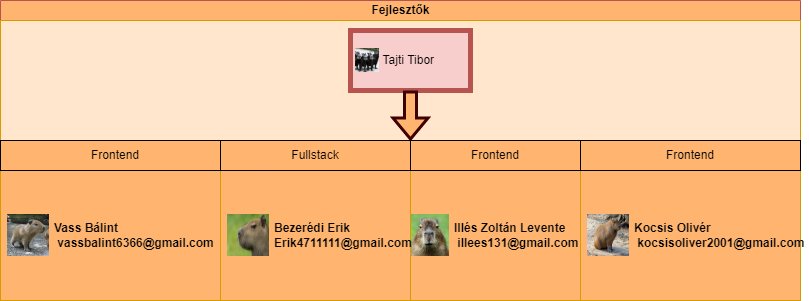

# Ütemterv
* Követelmény specifikáció létrehozásának határideje: 2022.10.17
* Funkcionális specifikáció létrehozásának határideje: 2022.09.17
* Rendszterv létrehozásának határideje: 2022.10.24
* Tesztek megírásának határideje: 2022.11.28
* A weboldal elkészülésének határideje: 2022.11.28

# Mérföldkövek
1. Funkcionális specifikáció és követelmény specifikáció létrehozása
2. Rendszerterv megalkotása
3. Kezdőoldal létrehozása (login rész)
4. Kezdőoldal megformázása, és stílus megalkotása
5. Főoldal létrehozása (naptár, időjárás, programok)
6. Főoldal megformázása, és stílus megalkotása
7. Oldalak összekötése
8. Kezdőoldal bejelentkezés és regisztráció megírása
9. Adatbázishoz kötés
11. Interaktív gombok, szövegek hozzáadása
12. Tesztelés
13. Bemutatás

# Üzleti szereplők
* A weboldalt bárki használhatja, aki rendelkezik internet hozzáféréssel. 
* Mivel bárki használhatja, így törekszünk, hogy minél egyszerűbb és könnyen kezelhető legyen a felület.

# Üzleti folyamatok
* A kezdőoldalon egy bejelentkezési felületet láthatunk, ahol beléphetünk a fiókunkba, vagy regisztrálhatunk egy új fiókot.
* Bejelentkezés után a főoldal tárul elénk, több információ is szolgálatunkra áll.
    * Első sorban egy naptár, amin ki lehet választani, hogy melyik napra szeretnénk programot szervezni.
    * Láthatunk egy időjárással kapcsolatos ablakot, ami tájékoztat minket az időjárásról, hogy a programokat ennek megfelelően szervezhessük.
* Lehetőségünk lesz kijelentkezésre, így visszavezet minket a kezdőoldalra, ha például fiókot szeretnénk váltani.

# Tesztterv
Minden programot tesztelni kell, mivel sohasem lehet tudni mikor mi nem működik úgy ahogy annak kellene.
Tökéletes kód nem létezik, ezért van szükség tesztelésre.
A kód írója persze állandóan nézi, hogy amit implementál, az úgy működik-e, ahogy ő azt tervezte, azonban ez szinte soha sem elég.
Ezért van mindig szükség legalább egy, de inkább több harmadik személyre is, akik kipróbálják a programot, mert ahány ember, annyiféle módon használnak egy alkalmazást.
Így bukkanhatunk rá olyan hibákra is, amire egyáltalán nem is számítottunk.
Azonban nem csak hibákat próbálunk keresni teszteléskor, hanem más szempontjából is akarjuk látni, hogy milyen is maga a program.
Kaphatunk ötleteket, hogy mivel egészítenék ki az eddigi munkát, vagy hogy min változtatnának rajta, mivel szerintük az jobb lenne a felhasználóknak.

A tesztelés fázisai:
* manuális teszt
* automatizált teszt
* alpha teszt
* beta teszt

A manuális teszt olyan teszt amit személyesen végzünk.

Az alpha teszt legfőképp in-house történik, hogy megnézzük működnek-e az alapfunkciók. Ilyen lehet például:

* elindul-e a program más környezetben/számítógépen
* működik-e minden gomb
* egy gomb nyomására az elvárt eredményt kapjuk-e, jelen esetben az adott napra kattintva bejön, az arra a napra tervezett események listja.

A beta teszt pedig már lehet nyilvános is, ilyenkor akárki tesztelheti, aki szeretné. Ekkor már rengeteg visszajelzést kaphatunk, lehet az bug report, vagy új ötlet, változtatás az eddigi működésben. Például:

* Gombok elhelyezése
* Reportok fogadása
* Más háttér alkalmazása

Sikeresnek mondható a teszt, ha már szinte semmiféle probléma nem található a programban, és a mások által feltett és a fejlesztő által elfogadott változtatásokat, újításokat is implementáltuk. Ezután meg is történhet a szoftver első kiadása.

## A rendszer céljai:
* Egy jól átlátható felület létrehozása.
* Jól olvasható szöveg, jól elkülönített tartalom.
* Feltűnő és érdekes kinézet.
* Az oldal átméretezése során, az oldal tartalma változzon úgy hogy, jól olvasható maradjon.
* Interaktív szöveg és gombok segítsék a felhasználót.
* Az oldal készítőinek elérhetőségeit feltüntetni.
* Jól működő login system
* Időjárás jelzése
* Valamilyen szavazási rendszer
* Az oldal könnyen kezelhető legyen.
* A felhasználó életének megkönnyítése. 
* A felhasználók adatainak bizalmas kezelése.
* A Felhasználók elkülönítése rangszerint
* A felhasználók egymáskozött az eseményeket megoszthassák.
* Programok rögzítése
* Időpont ütkozések problémájának lekezelése.
* Felmerülő ajánlások vagy esetleg figyelmeztetések mihamarabbi küldése.
* A szerkezthetőség mező eggyértelmű legyen.
* Minnél több esmény téma hozzáadása, ezáltal pontosabb ajánlások.
* Kommunikálni oldalon kívül a felhasználóval

## A rendszer nem céljai:
* Túl zsúfolt kezelő felelület.
* Összezavaró menürendszer. 
* Reklám megjelenítések.
* Felesleges felhasználói rangok
* "Like/Dislike" alapú szavazási rendszer kialakítása a hozzászólások megbízhatóságának megszavazása érdekében.
* Spam e-mail küldése a felhasználólnak.
* A felhasználó adatainak felhasználásaT
* Social regisztráció lehetőség

# A projekten dolgozók listája és feladatai:

1. Bezerédi Erik - FullStack programozó
2. Vass Bálint - FullStack programozó
3. Ilés Zoltán - FullStack programozó
4. Kocsis Olivér - FullStack programozó

* Bezerédi Erik felelős a weboldal mögött futó programok megírása JavaScript nyelven, illetve HTML PHP és CSS fejlesztés is. Hibajavítás és a többiek munkájának ellenőrzése is.
* Vass Bálint felelős a weboldal mögött futó programok megírása JavaScript nyelven, illetve HTML PHP és CSS fejlesztés is. Hibajavítás és a többiek munkájának ellenőrzése is.
* Illés Zoltán felelős a weboldal mögött futó programok megírása JavaScript nyelven, illetve HTML PHP és CSS fejlesztés is. Hibajavítás és a többiek munkájának ellenőrzése is.
* Kocsis Olivér felelős a weboldal mögött futó programok megírása JavaScript nyelven, illetve HTML PHP és CSS fejlesztés is. Hibajavítás és a többiek munkájának ellenőrzése is.

## Fizikai környezet

Visual studio code-ot használtunk a PHP,CSS,HTML illetve a javascript kódok megírásához. A weboldal megjelenítéséhez külön vásásrolt domaint illetve tárhelyet használunk. Az oldal jelenlegi teszteléséhez XAMOT használunk. Ezen belül futtatunk egy localis szervert és egy localis tárhelyet mellyet később éles webszerverre cserélünk.

### File tipusok
+ Css
+ PHP
+ java script
+ HTML

### Kölső szoftverek

+ Visual studo code
+ XAMP
+ ....
+ ....
