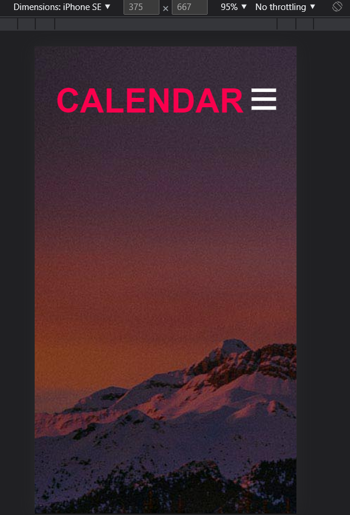
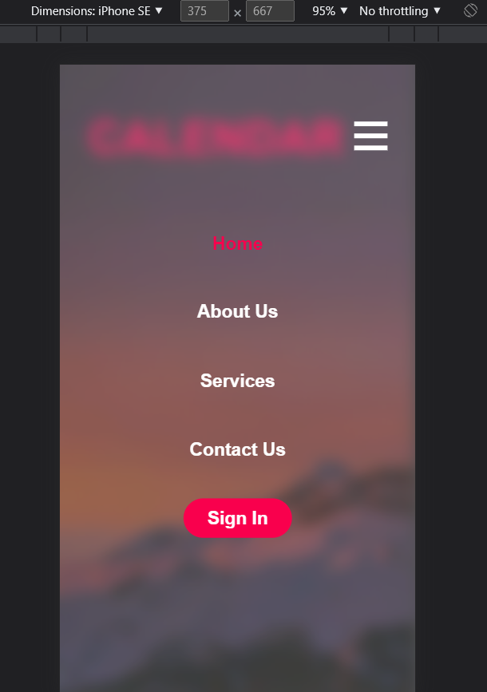
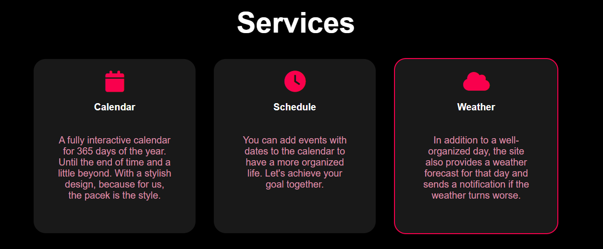
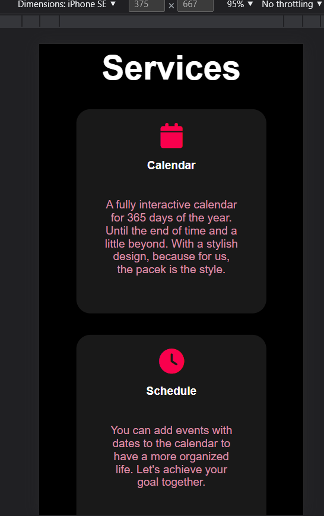

# ***Tesztelések dokumentációi***

## **Naptár - Hónapok közötti lépés tesztelése**

### **Elvárás:**
* A naptárban az évszám mellett látható "nyilakkal" lehet lépkedni a hónapok között és az év is változik.
* Minden évben minden hónap jó.
* Limit nincs rajta.

### **Teszt:**
* A jobbra mutató jellel (a képen jobb oldalon látható) a hónapok között haladhatunk előre. Ha elérünk decemberig akkor az évszám nő és kezdődik a hónapok kiírása Januárral.
* Limit nincs rajta. 2050-ig lett tesztelve, mindent jól ír, így feltételezhetjük azt, hogy a végtelenségig mindent jól fog írni.

---

## **Naptár - Program beírása adott napokra**

### **Elvárás:**
1. Kiválasztunk egy napot, majd erre rákattintva megjelenik az "Add Event" ablak, ahol megadhatunk eseményeket.
2. Másik napra kattintva a beírt események eltűnnek, mivel a beírt teendők aznapra voltak tervezve.
3. Újra megnyitjuk a napot amire beírtuk az eseményeket és azok nem tűntek el.

### **Teszt:**
* Adott napra való kattintás után tudunk hozzáadni több "event"-et. Más napra kattintva eltűnnek a beírt események és felvehetünk még több eseményt.
* A felvett események nem tűnnek el, ha váltunk napot.

---

## **Naptár - Becsukás után az adatok nem törlődnek**

### **Elvárás:**
* Az oldal vagy a böngésző becsukása után az adatok nem törlődnek ki.

### **Teszt:**
* Többször lett tesztelve a lap becsukása és a böngésző becsukása, de az adatok nem vesztek el.
* Természetesen ugyan azt a böngészőt kell használnunk mivel az adatok a böngészőben vannak eltárolva, így különböző böngészőt indítva nem lesz sikeres az adatok betöltése.

---

## **Naptár - Időjárás tesztelése**

1. Nem megfelelő város megadásakor nem lép tovább, nem megfelelő városnév amelyik nem létezik illetve ha nem megfelelő formátumú a megadott szöveg. Illetve a városnevek megadásánál kis- és nagybetű különbség nem számít.

2. Internet kapcsolat hiányában nem működik mivel, az adatokat egy nyílt API segítségével kapja meg. Amennyiben nem tudok csatlakozni az internethez, vagy az API-hoz nem ad megfelelő eredményt. Általában ilyenkor vagy az utolsó eltárolt adatot mutatja vagy pedig az API-nak köszönthetően Denver-i időjárást mutatja.

3. A pontossága tesztelve lett a programnak, hogy milyen nagy eséllyel ad vissza valóságnak megfelelő értékeket.
- Hőmérsékelt : Pontos volt a valóságtól 1-2 fokos eltérést tapasztaltunk maxmimum.
- Humidity : Az online adatoknak megfelelő adatot ad vissza.
- Wind speed : Az online adatoknak megfelelő adatot ad vissza.

4. A program csak az aznapi időjárás kiírására alkalmas az API korlátozottsága miatt.

---

## **Kezdőoldal - Mobil menü**

### **Elvárás:**
* Megadott képernyőméret esetén aktiválja a nav.js ben megírt kódot és a menü átvált a "mobil menü" módba és CSS szkript megváltoztatja a szerkezetet. Ez az új menü átveszi az eredeti kezelőfelület szerepét ezáltal rezponzívvá téve az oldalt.

* Azaz jobb felső sarokba megjelenik 3 vizszintes vonal amire kattintva megnyílik a legőrdülő menü. 

* Eltüntetni rákttintva lehet. Ennek hatására el kell tünnie, egy animációt bejátszva. 

### **Teszt:**

1. Három vonalas dizájn megjelent. (Ami valójában egy kép.)

2. Kattintásra müködött.

* A böngésző vizsgálat gombja segítségével lett tesztelve
* Ezen belül is a Dimensions kategoriába tobb eszközön is tesztelt.
* Tesztelt ezkoözök : PC , iPhone SE, iPhone 12, iPad Air, Samsung Galaxy S8+

---

## **Kezdőoldal - Elemek elhelyezkedése**

### **Elvárás:**
* Megadott képernyőméret esetén az oldalnak úgy kell reagálnia, hogy minden szöveg, illetve objektum is reszponzív. Azaz a képből ne lógjanak ki és úgy rendezzék át magukat, hogy az megfeleljen az oldal ktuális állapootának (méret).

### **Teszt:**

1. Asztali eszköz használata esetén így nézki:
 

2. Reszponziv reagálás:
 

* A böngésző vizsgálat gombja segítségével lett tesztelve. Ezen belül is a Dimensions kategoriába tobb eszközön is tesztelt.

* Hasonlóan a mobil menünél, itt is képernyő méretét állítottuk külömböző nagyságúra. Jól lehet látni, hogy az objektumok egymás alá csúsznak és kitőltik a teret.

| Lépések | Elvárt eredmény | Kapott eredmény| Böngésző |PASS / FAIL|Elvégezte|Dátum|
|---------|-----------------|----------------|----------|-----------|-----|-----|
|1|A regisztráció gomb megnyomásával a regisztráció fülre visz.|A gomb megnyomásával a kijelzőmegváltozik és betölti a regisztációt.| Brave | PASS| Bezerédi Erik | 2022.12.04|
|2|A login gomb megnyomásával a login fülre visz.|A gomb megnyomásával a kijelzőmegváltozik és betölti a logint.| Brave | PASS| Bezerédi Erik | 2022.12.04|
|3|Az adatok kitöltése és a regisztráció gomb megnyomása regisztrál.|A gomb megnyomásával a kijelzőmegváltozik és regisztáció megtörténik.| Brave | PASS| Bezerédi Erik | 2022.12.
|4|Az adatok kitöltése és a login gomb megnyomása belép.|A gomb megnyomásával a kijelzőmegváltozik és login megtörténik.| Brave | PASS| Bezerédi Erik | 2022.12.04
|5|A logout gomb megnyomása kilép.|A gomb megnyomásával a kijelzőmegváltozik és sikeresen kijelentkezik.| Brave | PASS| Bezerédi Erik | 2022.12.04
|6|A comment gomb megnyomása a comment funkcióhoz visz.|A gomb megnyomásával a kijelzőmegváltozik és sikeresen átlép.| Brave | PASS| Bezerédi Erik | 2022.12.04
|7|Szöveg begépelésénél és enter lenyomásnál elküldi a szöveget|A gomb megnyomásával a kijelzőmegváltozik és sikeresen kiírja a commentet.| Brave | PASS| Bezerédi Erik | 2022.12.04
|8|Megfelelően kiírja a felhasználó nevét.|Jól kiiírja a nevet!| Brave | PASS| Bezerédi Erik | 2022.12.04
|9|Az adatok megfelelően vannak tárolva|Az adatokat hibamentesen lementette| Brave | PASS| Bezerédi Erik | 2022.12.04
|10|Az adat lekérdezés gyors| Azonnal végrehajtja a lekérdezéseket| Brave | PASS | Bezerédi Erik | 2022.12.04
|11|Jól olvasható minden adat| Minden adat jól olvasható| Brave | PASS | Bezerédi Erik | 2022.12.04

