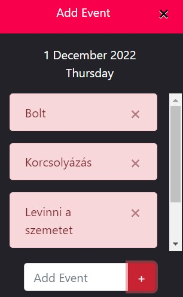

# ***Tesztelések dokumentációi***

## **Naptár - Hónapok közötti lépés tesztelése**

### **Elvárás:**
* A naptárban az évszám mellett látható "nyilakkal" lehet lépkedni a hónapok között és az év is változik.
* Minden évben minden hónap jó.
* Limit nincs rajta.

### **Teszt:**
* A jobbra mutató jellel (a képen jobb oldalon látható) a hónapok között haladhatunk előre. Ha elérünk decemberig akkor az évszám nő és kezdődik a hónapok kiírása Januárral.
* Limit nincs rajta. 2050-ig lett tesztelve, mindent jól ír, így feltételezhetjük azt, hogy a végtelenségig mindent jól fog írni.

---

## **Naptár - Program beírása adott napokra**

### **Elvárás:**
1. Kiválasztunk egy napot, majd erre rákattintva megjelenik az "Add Event" ablak, ahol megadhatunk eseményeket.
2. Másik napra kattintva a beírt események eltűnnek, mivel a beírt teendők aznapra voltak tervezve.
3. Újra megnyitjuk a napot amire beírtuk az eseményeket és azok nem tűntek el.

### **Teszt:**
* Adott napra való kattintás után tudunk hozzáadni több "event"-et. Más napra kattintva eltűnnek a beírt események és felvehetünk még több eseményt.
* A felvett események nem tűnnek el, ha váltunk napot.

---

## **Naptár - Becsukás után az adatok nem törlődnek**

### **Elvárás:**
* Az oldal vagy a böngésző becsukása után az adatok nem törlődnek ki.

### **Teszt:**
* Többször lett tesztelve a lap becsukása és a böngésző becsukása, de az adatok nem vesztek el.
* Természetesen ugyan azt a böngészőt kell használnunk mivel az adatok a böngészőben vannak eltárolva, így különböző böngészőt indítva nem lesz sikeres az adatok betöltése.

---